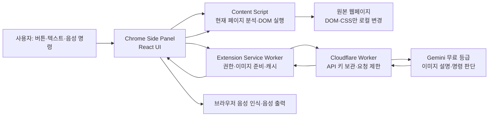

# AccessAI 해커톤 발표·기술 설명서

> 2026-09-14 현재 저장소 기준. 발표 전날에는 이 문서의 **당일 체크리스트**를 다시 확인한다.

## 1. 한 문장 소개

**“웹사이트가 사용자를 충분히 배려하지 못했다면, 브라우저가 대신 배려한다.”**

AccessAI는 사용자가 이미 보고 있는 웹페이지를 브라우저 안에서 분석하고, 부족한 이미지 설명·작은 글씨·색 대비를 보완하며, 한국어 음성으로 기본 탐색을 돕는 Chrome 확장프로그램이다. 원본 웹사이트의 서버를 수정하지 않는다. 완전한 스크린리더나 WCAG 인증 도구가 아니라, 기존 스크린리더가 활용할 수 있는 접근성 정보를 보완하는 MVP다.

### 30초 소개 멘트

> “웹사이트의 사진에 설명이 없거나 글씨가 너무 작으면 사용자는 그 사이트가 개선되기를 기다려야 합니다. AccessAI는 기다리는 대신 지금 열려 있는 페이지에서 의미 있는 사진을 찾아 설명을 만들고, 글씨와 대비를 개선합니다. ‘본문 읽어줘’, ‘검색해줘’ 같은 명령도 사용할 수 있습니다. AI는 무엇을 할지만 판단하고 실제 클릭과 입력은 확장프로그램이 검사한 뒤 실행합니다.”

## 2. 시연할 수 있는 기능과 현재 상태

| 기능 | 실제 동작 | AI 필요 여부 |
| --- | --- | --- |
| 페이지 접근성 분석 | `axe-core`로 WCAG A/AA 위반을 탐지하고, 작은 글씨와 설명이 필요한 사진 수를 표시 | 불필요 |
| 이 페이지 개선 | 작은 글씨를 16px로 보완하고 줄간격·키보드 초점 표시를 강화. 고대비 옵션 제공 | 스타일 개선 자체는 불필요. 동의 시 사진 설명도 실행 가능 |
| 이미지 설명 | 본문 사진을 골라 짧은 설명을 생성하고 실제 `img.alt`에 반영. 원상 복구 가능 | 필요 |
| 본문 읽기 | 본문 첫 문장부터 읽고, 읽는 문장을 강조하며 화면이 따라감 | 대개 불필요. 본문 시작이 모호할 때만 AI로 후보 선택 |
| Voice Mode | 마이크로 한국어 명령을 받고 브라우저 음성으로 답변 | 음성 입출력 자체는 브라우저 기능. 복잡한 명령 해석·답변에는 AI 필요 |
| 검색·클릭·입력·스크롤 | 현재 페이지에서 찾은 실제 요소를 대상으로 실행 | 명확한 일부 명령은 로컬 처리, 그 외에는 AI 판단 |
| 위험 행동 확인 | 결제·삭제·구매·중요 제출 등은 사용자 확인 후 실행 | 판단은 AI를 거칠 수 있으나 최종 실행은 사용자 확인 필요 |
| 단축키 | `Alt+X`로 패널 열기, `Alt+A`로 마이크 시작. macOS에서는 Option 키 | 불필요 |

**현재 미구현:** 목소리 종류·속도 선택 UI, 공식 시연용 전용 웹페이지. 현재 음성 출력은 기기의 첫 한국어 목소리와 기본 속도 1배를 사용한다. 목소리 설정은 향후 무료 로컬 음성만 노출하는 방향으로 검토했다.

## 3. 전체 구조 — AI는 판단하고, 코드는 실행한다

- **Side Panel**은 사용자 동의, 분석 결과, Voice Mode, 대화와 위험 행동 확인 화면을 맡는다.
- **Content Script**는 방문한 페이지의 보이는 요소를 수집하고, 실제 클릭·입력·스크롤·스타일 변경·`alt` 반영을 한다. AI API 키에 접근하지 않는다.
- **Service Worker**는 확장 UI에서 온 요청만 받는다. 이미지 원본을 준비하거나 보이는 부분을 캡처하고, 크기를 줄인 뒤 로컬 캐시를 확인한다.
- **Cloudflare Worker**는 Gemini 키를 Secret으로 보관한다. 요청 형식·크기·Origin·속도를 확인하고 모델과 출력 형식을 고정한다.
- **Gemini**는 이미지 설명, 모호한 본문 시작 후보 선택, 자연어 명령의 제한된 행동 선택을 맡는다. 웹페이지를 직접 조작하지 않는다.

기술 선택: **Manifest V3 + WXT + TypeScript + React + Zod + axe-core + Web Speech API + Cloudflare Workers + Gemini Developer API**. 데이터베이스나 사용자 계정은 없다.

### 명령 하나가 실행되는 순서

1. Side Panel이 현재 페이지의 제목·본문 일부·조작 가능한 요소 목록과 임시 ID를 받는다.
2. 명확한 로컬 명령은 바로 처리하고, 그 외 명령은 사용자 동의 후 AI에 보낸다.
3. AI는 `CLICK(id)`, `TYPE(id,text)`, `SEARCH(id,text)`, `READ(id)`, `SCROLL(direction)`, `ANSWER(text)` 같은 **한 개의 제한된 action**을 반환한다.
4. 확장프로그램은 ID가 현재 페이지에 실제로 존재하는지, 숨겨지거나 비활성화되지 않았는지, 분석 당시와 대상·주소·폼이 같은지 다시 확인한다.
5. 위험 행동이면 확인 화면을 띄우고, 안전한 행동이면 Content Script가 실행한다. 선택된 대상에는 잠시 윤곽선이 표시된다.

설명할 때는 **“AI는 클릭할 대상을 제안할 뿐, 클릭 권한을 직접 갖고 있지 않다”**라고 말하면 된다. 웹페이지 안의 문구도 신뢰할 수 없는 입력으로 취급한다.

## 4. 차별화 포인트를 설명하는 실제 구현

### 이미지 설명

장식용·작은 아이콘, 광고, 관련 기사, 기자 프로필 등을 제외하고 의미 있는 사진을 고른다. 기사에서는 `#dic_area`, `articleBody`, `article` 등 **본문 범위가 한 곳으로 확정될 때** 그 안의 사진만 사용한다. 본문이 모호하면 엉뚱한 광고 사진을 설명하지 않도록 중단한다. 기존 `alt`가 짧게 있더라도 그것을 최종 설명으로 믿지 않고 이미지를 분석한다.

이미지 픽셀은 브라우저에서 준비한다. 가능하면 이미지 자체를 사용하고, 교차 출처 제한 등으로 읽지 못하면 원본 URL을 시도하며, 그것도 실패하면 화면에 보이는 해당 사진 영역을 캡처한다. 전송 전에 크기를 줄이고, 같은 이미지 픽셀의 해시를 키로 설명을 로컬에 최대 30일 캐시한다. 생성한 문장은 `img.alt`에 쓰므로 기존 스크린리더에서도 사용할 수 있고, “원상 복구”로 이전 `alt`를 되돌릴 수 있다.

### 진짜 본문부터 읽기

사이트마다 본문 구조가 달라 `p` 태그만 읽으면 저작권 고지문을 읽을 수 있다. AccessAI는 기사 본문 선택자와 `article`을 먼저 찾고, 일반 페이지에서는 문장 길이·줄바꿈·문장부호를 근거로 시작 위치를 찾는다. 예를 들어 나무위키 ‘사과’ 문서의 링크로 나뉜 첫 정의를 **“사과나무의 열매.”**로 이어 읽는다. 시작이 애매하면 후보 문단의 짧은 미리보기만 AI에 보내 번호를 고르게 하고, 실제 낭독은 원래 페이지의 문장을 사용한다.

낭독은 짧은 조각으로 나누어 음성 재생이 다음 조각에 도달할 때 해당 DOM 글자 범위를 강조한다. 현재 문장이 화면 밖에 있을 때만 스크롤하며 키보드 초점은 빼앗지 않는다. “멈춰”와 “다시 읽기”도 이 낭독 위치와 연결되어 있다.

### 동적으로 바뀌는 사이트 대응

`MutationObserver`로 페이지 변경을 감지하지만, 광고 하나가 바뀌었다고 모든 명령을 거절하지는 않는다. 클릭하려는 링크의 목적지, 검색 폼, 읽을 본문처럼 **그 행동에 필요한 부분**을 실행 직전에 다시 비교한다. 대상이 달라졌다면 다시 명령하도록 안내한다. Chrome 새 탭에서는 페이지 분석 대신 “사과를 검색해줘” 명령으로 Google 검색 결과를 열고, 결과 페이지에서 분석을 이어 간다.

## 5. 무료 사용·키 보안·개인정보에 대한 답변

- **심사위원 PC에는 키가 없다.** 확장프로그램 ZIP에는 서버 URL만 있고 Gemini API 키는 Cloudflare Worker Secret에만 있다. `pnpm package`가 ZIP의 비밀키 패턴과 개발 서버 주소를 검사한다.
- **AI 요청은 최초 동의 후에만 전송한다.** 필요한 페이지 텍스트·요소 정보 또는 분석할 이미지가 프록시를 통해 Gemini로 간다. 전체 HTML과 비밀번호·카드 자동완성·OTP 값은 보내지 않도록 수집 단계에서 제외한다. 다만 페이지 주변 문맥에 개인정보가 있을 수 있으므로 민감한 페이지는 시연하지 않는다.
- **무료 한도에서 멈춘다.** Gemini 프로젝트와 Workers를 무료 구성으로 운영하고, 429나 한도 소진 시 오류를 보여준다. 유료 모델로 자동 전환하거나 무한 재시도하지 않는다. `FREE_TIER_CONFIRMED`는 운영자가 무료 설정을 확인했다는 플래그이지 결제 상태를 자동 검사하는 기능은 아니다.
- **원본 사이트 서버는 그대로다.** 스타일과 `alt` 수정은 사용자 브라우저의 DOM/CSS에 적용한다. 단, 사용자가 승인한 버튼 클릭이나 폼 제출은 원본 사이트에 실제 영향을 줄 수 있다.
- **공유 프록시의 한계가 있다.** Origin 제한은 일반적인 브라우저 요청 경계이지 강한 사용자 인증이 아니다. 공개 ZIP과 회원가입 없는 MVP라 대규모 남용까지 완전히 차단하지는 못한다.

운영 세부사항: [OPERATIONS.md](OPERATIONS.md) · 데이터 처리: [PRIVACY.md](PRIVACY.md)

## 6. 발표 시연 순서 — 약 3~4분

시연은 **미리 설치한 최신 빌드**와 미리 정한 2~3개 일반 HTML 페이지에서 한다. 실제 사이트는 당일 구조가 바뀔 수 있으므로 전날 같은 브라우저 프로필에서 한 번 리허설한다. 공식 전용 Demo Page는 아직 없다.

1. **문제 제시 (20초):** 사진 설명이 없거나 작은 글씨가 있는 페이지를 보여준다. “사이트 자체를 다시 만드는 대신 현재 페이지에 적용한다”라고 설명한다.
2. **분석·개선 (50초):** `Alt+X`로 AccessAI를 열고 **현재 페이지 분석**을 누른다. 사진·대비·작은 글씨 수를 가리킨 뒤 **이 페이지 개선**과 고대비 옵션을 보여준다. **원상 복구**도 짧게 보여준다.
3. **사진 설명 (60초):** 본문 사진이 있는 기사에서 **“사진 설명해줘”** 또는 **“본문 사진 전부 설명해줘”**를 실행한다. 사진에 표시되는 설명과 Side Panel 음성 답변을 보여준다. AI는 네트워크·무료 한도에 영향을 받으므로 전날 성공한 페이지를 준비한다.
4. **본문 따라 읽기 (40초):** 나무위키 ‘사과’처럼 본문이 링크·줄바꿈으로 구성된 페이지에서 **“본문 읽어줘”**를 실행한다. 첫 문장과 읽는 부분의 강조·화면 이동을 보여주고 **“멈춰”**를 시연한다.
5. **탐색 명령 (40초):** 검색창이 있는 페이지에서 **“사과를 검색해줘”** 또는 **“검색창에 사과 입력해줘”**를 실행해 실제 결과 페이지 이동을 보여준다. 입력만 하려면 **“입력만 해줘”**라고 구별한다.
6. **안전성 마무리 (20초):** “AI가 선택하고 코드는 재검증해 실행하며, 결제·삭제·제출은 확인을 요구한다”고 설명한다. 실제 결제·삭제 행동은 시연하지 않는다.

**음성 인식이 실패하면** 같은 명령을 Side Panel 입력란에 타이핑한다. 마이크 권한 창이 Side Panel에서 안 나오면 **별도 창에서 열기**를 사용한다. 두 경로 모두 같은 명령 실행 기능이다.

### 슬라이드 5장 구성 예시

1. 문제와 한 문장 아이디어: 접근성이 부족한 기존 사이트를 사용자 측에서 보완.
2. 실제 화면 전후: 분석 수치 → 개선된 글씨·대비·이미지 설명.
3. Voice Mode 시연: 말하기 → AI의 제한된 action → 실제 페이지 동작.
4. 구조와 안전성: Side Panel / Content Script / Worker / Gemini, “AI는 판단, 코드는 실행”.
5. 한계와 다음 단계: 무료 한도·사이트별 차이, 목소리 설정 UI와 공식 Demo Page 등.

## 7. 심사위원 설치와 개발자 운영은 다르다

**심사위원 설치:** [AccessAI-submission.zip](https://github.com/maker240305/accessai/releases/latest/download/AccessAI-submission.zip)을 압축 해제 → `chrome://extensions` → 개발자 모드 → **압축해제된 확장 프로그램을 로드** → 압축을 푼 `AccessAI` 폴더 선택. Node.js, npm, API 키 입력, 서버 실행은 필요하지 않다. 데스크톱 Chrome과 인터넷 연결은 필요하다.

**개발자 빌드:** 저장소에서 Node.js 22 이상과 pnpm으로 `pnpm install`, `pnpm typecheck`, `pnpm lint`, `pnpm test`, `pnpm package`를 실행한다. 결과는 `extension/.output/chrome-mv3/`와 `artifacts/AccessAI-submission.zip`에 생성된다. 프록시 코드를 바꿨을 때만 `pnpm proxy:deploy`로 별도 배포한다. 키 등록 방식은 [OPERATIONS.md](OPERATIONS.md)를 따른다.

## 8. 발표 당일 체크리스트

- [ ] [제출 ZIP](https://github.com/maker240305/accessai/releases/latest/download/AccessAI-submission.zip)이 최신 빌드인지 확인하고, **압축 해제 후 `AccessAI` 폴더**를 선택하는 설치 과정을 연습한다.
- [ ] Chrome에서 확장프로그램을 새로고침한다. `Alt+A`·`Alt+X`가 다른 확장과 충돌하면 `chrome://extensions/shortcuts`에서 재지정한다.
- [ ] 시연용 일반 HTML 페이지 2~3개를 미리 열고 각각 **분석, 이미지 설명, 본문 읽기, 검색**이 실제로 되는지 리허설한다. 사이트 구조와 이미지가 바뀌면 대체 페이지를 사용한다.
- [ ] 네트워크 연결, `https://accessai-proxy.accessai.workers.dev/health`의 `ready: true`, Gemini 무료 사용 가능 상태를 확인한다. AI가 멈추면 429/502/503 안내에 맞춰 설명한다.
- [ ] Gemini 프로젝트에 결제 계정을 연결하지 않았고 Cloudflare Workers를 유료로 올리지 않았는지 운영 화면에서 확인한다. 무료 한도는 당일 변할 수 있다.
- [ ] AI 전송 동의, 웹사이트 접근 권한, 마이크 권한을 시연 프로필에서 미리 처리한다. 마이크가 불안정할 경우 입력란으로 시연할 준비를 한다.
- [ ] 음량을 확인하고, 민감한 계정·개인정보·결제 화면이 시연에 노출되지 않게 한다.
- [ ] 네트워크/AI가 실패해도 설명할 수 있도록 주요 전후 화면 캡처와 이 문서를 로컬에 보관한다. 캡처는 실제 동작을 대체하는 것임을 분명히 말한다.

## 9. 예상 질문과 짧은 답

**Q. 기존 사이트 코드를 바꾸나요?**  
A. 아니요. 사용자의 브라우저에서 DOM과 CSS를 일시적으로 보완한다. 원상 복구가 가능하다.

**Q. AI가 마음대로 결제나 삭제를 누를 수 있나요?**  
A. AI는 제한된 action 하나를 제안한다. 확장프로그램이 현재 대상과 위험도를 다시 검사하고, 결과가 큰 행동은 사용자가 확인해야 한다.

**Q. 사진마다 AI를 계속 호출하나요?**  
A. 같은 이미지 픽셀의 해시로 로컬 설명을 캐시한다. 다시 방문해도 캐시가 유효하면 AI 호출을 줄인다.

**Q. 왜 모든 사이트에서 완벽히 작동하지 않나요?**  
A. 웹페이지 구조가 다르고 iframe·캔버스·PDF 같은 경우는 일반 DOM 탐색만으로 접근하기 어렵다. 그래서 모호한 본문이나 사진을 억지로 처리하지 않고 사용자에게 알려준다.

**Q. 무료인가요?**  
A. 운영자가 확인한 Gemini·Workers 무료 구성에서 동작하고 한도에 닿으면 중단한다. 실시간 잔여 한도와 계정 결제 상태는 발표 당일 운영 화면에서 다시 확인해야 한다.

**Q. 스크린리더를 대체하나요?**  
A. 아니다. 기존 스크린리더가 읽을 수 있는 `alt`를 보완하면서 기본 음성 탐색을 별도로 제공한다.

## 10. 코드를 보여줄 때 펼칠 파일

| 보여줄 내용 | 파일 |
| --- | --- |
| 제한된 AI action과 입력 검증 | [`shared/protocol.ts`](../shared/protocol.ts) |
| Side Panel, 음성 입력·출력, 확인 화면 | [`extension/entrypoints/sidepanel/App.tsx`](../extension/entrypoints/sidepanel/App.tsx) |
| 실제 페이지 메시지 처리 | [`extension/entrypoints/content.ts`](../extension/entrypoints/content.ts) |
| DOM 수집·재검증·본문 따라 읽기 | [`extension/core/dom.ts`](../extension/core/dom.ts) |
| 본문 사진 선택·이미지 준비 | [`extension/core/images.ts`](../extension/core/images.ts) |
| axe 분석·글씨/대비 개선·원상 복구 | [`extension/core/accessibility.ts`](../extension/core/accessibility.ts) |
| 키를 숨긴 AI 프록시, 무료 한도 오류 처리 | [`proxy/index.ts`](../proxy/index.ts) |
| Chrome 권한·단축키·고정 확장 ID | [`extension/wxt.config.ts`](../extension/wxt.config.ts) |
| 제출 ZIP 생성·비밀키 검사 | [`scripts/package.mjs`](../scripts/package.mjs) |
| 테스트 내용과 검증 범위 | [VALIDATION.md](VALIDATION.md) |

## 11. 정직하게 말할 한계와 다음 단계

현재 지원 중심은 일반 HTTP/HTTPS 웹페이지의 메인 프레임과 DOM으로 드러난 요소다. Chrome 내부 페이지, 내장 PDF, 교차 출처 iframe, 닫힌 Shadow DOM, 캔버스 UI, 일부 자동화 차단 사이트에서는 기능이 제한될 수 있다. AI 이미지 설명은 틀리거나 중요한 세부사항을 빠뜨릴 수 있다. 브라우저·OS별 마이크와 음성 엔진도 차이가 있다. 접근성 분석 수치는 자동 탐지 결과이며 전체 WCAG 적합성 판정이 아니다.

다음 단계는 **무료 로컬 한국어 목소리·속도 선택 UI**, 사이트별 본문 선택 정확도 개선, 실제 사용자·보조공학 테스트, 공식 시연용 페이지 제작이다. 공식 Demo Page는 현재 제출물에 포함되지 않는다.
